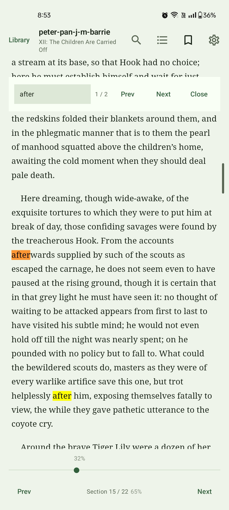
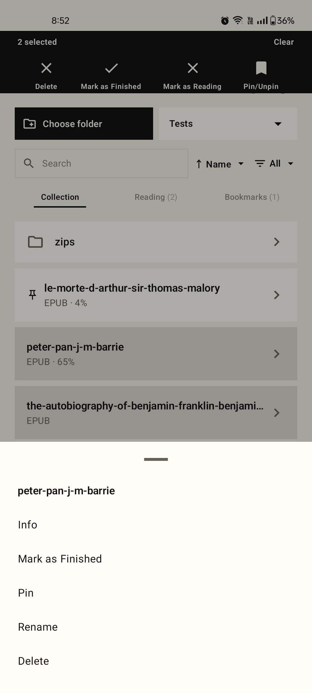
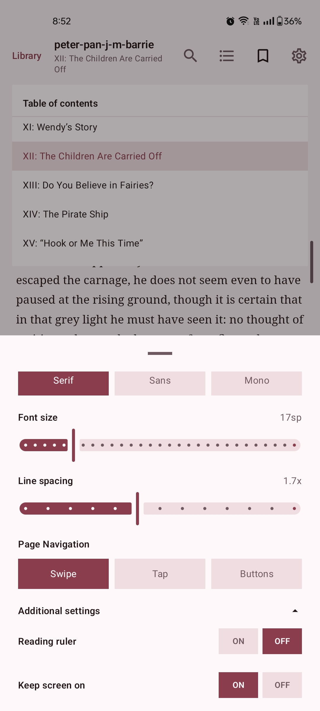
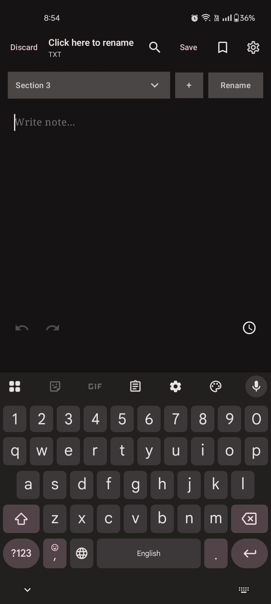

<p align="center">
  
</p>

<p align="center">
  <b>Areada</b>
</p>

<p align="center">
  A minimal offline Android reader focused on lightweight local reading.
</p>

Areada supports EPUB, PDF, TXT, FB2, FBZ, FB2 ZIP, and a wide range of archive formats including ZIP, 7z, tar, and more. It provides a clean monochrome interface, local folder-based reading, saved progress, bookmarks, search, filters, sectioned notes, and simple reader-focused controls.

## Latest Release

Latest version: **v1.1.2**

<p>
  <a href="https://github.com/iTsMe-Zen/Areada/releases/latest">
    
  </a>
  <a href="https://f-droid.org/en/packages/app.areada/">
    
  </a>
</p>

> **Note:** For the newest APK, use GitHub releases. The latest version may appear on GitHub before F-Droid. F-Droid updates can take some time to become available.

## Supported Formats

- EPUB
- PDF
- TXT
- FB2
- FBZ
- FB2 ZIP
- ZIP, 7z, gz, bz2, xz, tar, tar.gz / tgz, tar.bz2 / tbz2, and tar.xz / txz archives containing EPUB, PDF, TXT, or FB2

FB2 support includes:

- `.fb2`
- `.fb2.zip`
- `.fbz`

Areada can open `.zip`, `.7z`, `.gz`, `.bz2`, `.xz`, `.tar`, `.tar.gz` / `.tgz`, `.tar.bz2` / `.tbz2`, and `.tar.xz` / `.txz` archives containing supported book files such as EPUB, PDF, TXT, or FB2. If an archive contains multiple supported books, Areada shows a chooser.

Encrypted, split, and nested archives are not supported.

## Features

- **Local reading:** EPUB, PDF, TXT, FB2, FBZ, FB2 ZIP, and supported archive reading with saved progress
- **Home tabs:** Compact Books, Reading, and Bookmarks tabs for cleaner library browsing
- **Bookmarks:** Persistent local bookmarks for supported reading files
- **Recent reading:** Quickly resume files from the Reading tab
- **Search and filters:** Search folders, files, notes, bookmarks, and reading items with EPUB/PDF/TXT/FB2 filters
- **Folder-aware filtering:** Folders remain visible when they contain matching files or matching subfolders
- **Sorting:** Sort by name, added date, recently opened, reading progress, and file type
- **Navigation:** EPUB table of contents, stable EPUB section navigation, PDF page navigation, and quick bookmark access from Home
- **PDF improvements:** Better rendering for existing PDF annotations, callouts, and highlights on supported Android versions
- **Links:** PDF internal/external links and EPUB external links, with confirmation before opening external links
- **Reader controls:** Theme, font family, font size, reader orientation, page navigation mode (Swipe, Tap, Buttons), reading ruler/focus line, and pinch-to-zoom support where available
- **Notes:** Create and edit local `.txt` notes with readable `# Heading` sections for organized note tabs
- **Book Notes:** Link a local note to a book from the reader context
- **Note safety:** Plain-text timestamps, undo/redo, autosave behavior, section restore, and save/discard confirmation for editable TXT notes
- **Localization:** Language setting with Nepali and Brazilian Portuguese groundwork; Android string resources prepared for further translation
- **Compatibility:** Crash on rotation, gesture loss after page turns, pinch-zoom freezing, and false swipe triggers fixed for Android 6.0+; PDF zoom no longer locks after pinch-zoom
- **File access:** Storage Access Framework folder picker with no device-wide automatic scanning
- **Offline-first:** No internet permission, no ads, no analytics, and no tracking
- **Lightweight design:** Clean Jetpack Compose UI with a minimal monochrome interface

## Privacy

Areada is designed to work fully offline.

The app does not collect, upload, sell, or share user data. Files opened in the app remain on the user's device. The app does not require internet permission.

Areada does not include ads, analytics, tracking, accounts, cloud sync, crash reporting, or external services.

## Screenshots

<div align="center">

<table>
  <tr>
    <th align="center">Library</th>
    <th align="center">Swipe Actions</th>
  </tr>
  <tr>
    <td align="center">
      
    </td>
    <td align="center">
      
    </td>
  </tr>
</table>

<br />

<table>
  <tr>
    <th align="center">Settings</th>
    <th align="center">Notes</th>
  </tr>
  <tr>
    <td align="center">
      
    </td>
    <td align="center">
      
    </td>
  </tr>
</table>

</div>

## Package Name

```txt
app.areada
```